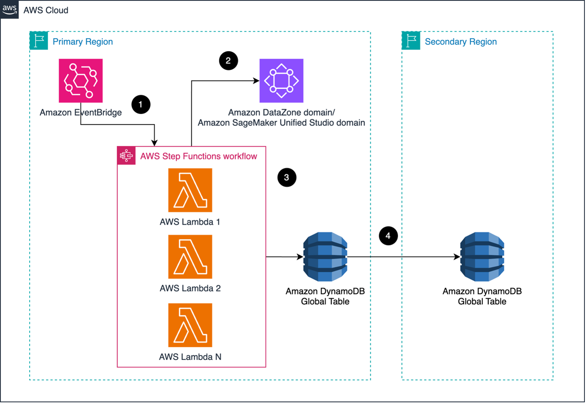

# Embracing event driven architecture to enhance resilience of data solutions built on Amazon SageMaker

## Content

  - [Content](#content)
  - [Overview](#overview)
  - [Target Audience](#target-audience)
  - [Key Features](#key-features)
  - [Architecture](#architecture)
  - [Repository Structure](#repository-structure)
  - [Getting Started](#getting-started)
    - [Prerequisites](#prerequisites)
    - [Deploy Solution](#deploy-solution)
    - [Clean Up](#clean-up)
 - [Security](#security)
 - [License](#license)
 - [Feedback](#feedback)


## Overview

This repository contains the AWS CDK code that implements backup captures and stores system metadata of the data solution built on Amazon SageMaker at regular interval. This code sample stores asset information of a data solution built on Amazon DataZone domain and Amazon SageMaker Unified Studio domain in an Amazon DynamoDB global table.

## Target Audience

The target audience of this solution are data engineers, cloud engineers, cloud architects, and DevOps engineers.


## Architecture

The following diagram displays the data mesh reference architecture based on Amazon DataZone using Amazon S3 and AWS Glue Data Catalog as data source.




## Getting Started


### Prerequisites
*	One active AWS account.

*	AWS administrator credentials for the central governance account in your development environment. 

*	AWS Command Line Interface (AWS CLI) installed to manage your AWS services from the command line (Recommended).

*	Node.js and Node Package Manager (npm) installed to manage AWS CDK applications.


```bash
npm install -g aws-cdk
```

* TypeScript is installed in your development environment. Install it globally using npm compiler.

```bash
npm install -g typescript
```
* Docker is installed in your development environment (Recommended).


### Deploy Solution

This section describes the steps to deploy the data governance solution.  

#### 1. Set up development environment

This step provides instructions to set up your development environment. Ensure that the prerequisites are met, before proceeding with this step. 

See [Set up environment](docs/set_up_environment.md) for more details.

#### 2. Deploy Resources for Data Solutions Built on an Amazon DataZone Domain

In the AWS Account, the following key resources are deployed:

1. **Amazon DataZone Domain**: The Amazon DataZone domain helps you organize data assets, users, environments and projects in your organization.

2. **Amazon DataZone data portal**: The Amazon DataZone data portal is a browser-based web application where you can catalog, discover, govern, share, and analyze data in a self-service manner. 

3. **Amazon DataZone Producer Projects and Environments**: The Amazon DataZone data Producer projects and environments are deployed in the Central Governance Account. This solution uses Data Lake blueprint to create the Amazon DataZone environment.

4. **AWS IAM Roles for Data Users**: The solution deploys AWS IAM roles corresponding to data users of the data mesh. The solution can be extended to SSO users.

5. **Amazon DynamoDB Global Table** - The Amazon DynamoDB table stores information about DataZone assets for resilience and backup purposes.

6. **AWS Step Functions** - The AWS Step Function State Machine orchestrates the backup workflow.


See [Deploy for DataZone Domain](docs/deploy_for_datazone_domain.md) for more details.


#### 3. Deploy Resources for Data Solutions Built on an Amazon SageMaker Unified Studio Domain

In the AWS Account, the following key resources are deployed:

1. **Amazon DynamoDB Global Table** - The Amazon DynamoDB table stores information about DataZone assets for resilience and backup purposes.

2. **AWS Step Functions** - The AWS Step Function State Machine orchestrates the backup workflow.

See [Deploy for SageMaker Unifed Studio Domain](docs/deploy_for_sagemaker_unified_studio_domain) for more details.


### Clean Up

Clean up the solution using the following steps.

See [Clean up](docs/clean_up.md) for more details.


## Security

See [CONTRIBUTING](CONTRIBUTING.md#security-issue-notifications) for more information.

## License

This library is licensed under the MIT-0 License. See the LICENSE file.

## Feedback 

Have an issue? Please create an issue in [the GitHub repository](https://github.com/aws-samples/data-mesh-datazone-cdk-cloudformation/issues/new)


